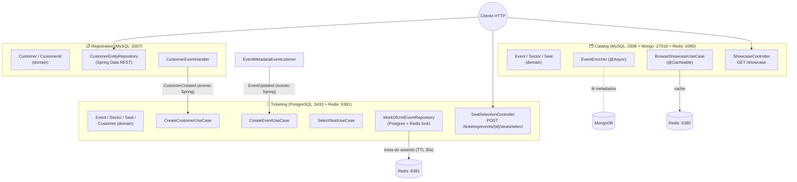
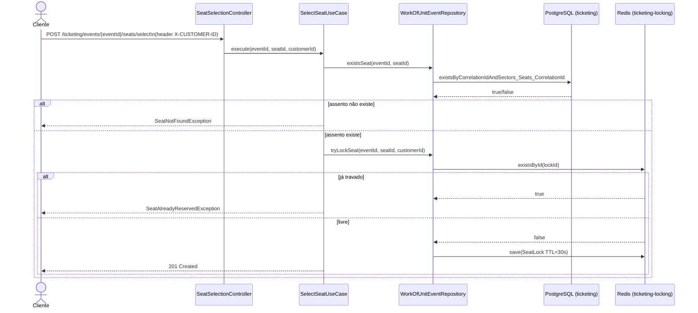

# 🎟️ Ticketing System — DDD Modular Monolith com Persistência Poliglota

> Sistema de gerenciamento de eventos, clientes e reserva de assentos (ticketing), construído como estudo prático de **Domain-Driven Design**, **Spring Data** (JPA multi-datasource, MongoDB, Redis) e **comunicação orientada a eventos** dentro de um monólito modular em Java 25.

Projeto desenvolvido durante o bootcamp **Java AI Backend - 2026 / Santander (DIO)**, módulo 5, curso 2 — *Spring Data*.

---

## 🧭 Visão geral

O projeto simula uma plataforma de venda de ingressos, dividida em três domínios de negócio independentes que colaboram entre si:

| Domínio | Responsabilidade | Banco de dados |
|---|---|---|
| **Registration** | Cadastro de clientes (dados pessoais e endereço) | MySQL (relacional) |
| **Catalog** | Catálogo de eventos exibido na vitrine (showcase), enriquecido com metadados | MySQL (dados estruturais do evento) + MongoDB (metadados flexíveis: descrição, requisitos técnicos, setores/assentos) + Redis (cache da vitrine) |
| **Ticketing** | Núcleo transacional: cria cliente/evento espelhados a partir dos eventos dos outros módulos e executa a seleção/reserva de assentos, evitando overbooking | PostgreSQL (relacional) + Redis (trava distribuída de assentos) |

Cada módulo é **auto-suficiente** (seu próprio banco, seu próprio `EntityManagerFactory`, seu próprio `DataSource`) e a integração entre eles não acontece por chamada direta de repositório/serviço, e sim por **eventos internos do Spring** (`ApplicationEventPublisher` / `@EventListener`), simulando a comunicação que existiria entre microsserviços reais — sem a complexidade de um broker externo (Kafka/RabbitMQ).

---

## 🛠 Tecnologias

| Categoria | Tecnologia |
|---|---|
| Linguagem | Java 25 (toolchain Gradle) |
| Build | Gradle (`build.gradle`, Groovy DSL) |
| Framework | Spring Boot 4.1.0 |
| Persistência relacional | Spring Data JPA + Hibernate, MySQL Connector/J, PostgreSQL Driver, HikariCP |
| Persistência NoSQL documental | Spring Data MongoDB |
| Cache / Lock distribuído | Spring Data Redis + Jedis (`spring.data.redis.client-type=jedis`) |
| API REST | Spring Web, Spring Data REST + HAL Explorer |
| Validação | Spring Boot Starter Validation (Jakarta Bean Validation) |
| Observabilidade | Spring Boot Actuator (`/actuator/health`) |
| Boilerplate | Lombok (via plugin `io.freefair.lombok`) |
| Concorrência | Virtual Threads (Java 21+), `@Async`/`CompletableFuture` |
| Infraestrutura de containers | Docker Compose (`spring-boot-docker-compose`) |
| Testes | JUnit 5 (`spring-boot-starter-test`, `junit-platform-launcher`) |

---

## 📂 Estrutura de pastas

```
src/main/java/br/com/dio/dioprojetomodulo5curso2springdata/
├── DioProjetoModulo5Curso2SpringDataApplication.java   # @SpringBootApplication @EnableAsync @EnableCaching
│
├── catalog/
│   ├── CatalogConfiguration.java          # DataSources MySQL + Mongo + Redis (cache)
│   ├── application/                       # BrowseShowcaseUseCase, EventEnricher, dto/EventOutput
│   ├── domain/                            # Event, EventId, EventMetadata, Sector(Id), Seat(Id), *Repository
│   └── infrastructure/
│       ├── event/                         # EventListener (JPA), EventMetadataEventListener (Mongo)
│       ├── http/                          # ShowcaseController
│       └── persistence/{entity,repository}
│
├── common/
│   └── infrastructure/event/dto/          # CustomerCreated, EventUpdated (contratos entre módulos)
│
├── registration/
│   ├── domain/                            # Customer, CustomerId, CustomerRepository
│   └── infrastructure/
│       ├── RegistrationConfiguration.java # DataSource MySQL @Primary
│       ├── event/CustomerEventHandler.java
│       └── persistence/{entity,repository}(entity/projection/CustomerExcerpt)
│
└── ticketing/
    ├── application/                       # CreateCustomerUseCase, CreateEventUseCase, SelectSeatUseCase
    ├── domain/                            # Customer, Event, Sector, Seat (+ Ids), exceções de negócio
    └── infrastructure/
        ├── TicketingConfiguration.java    # DataSource Postgres + RedisTemplate (lock)
        ├── event/TicketingEventListener.java
        ├── http/                          # SeatSelectionController, request/SeatSelectionRequest
        └── persistence/{entity,repository} (WorkOfUnitEventRepository, RedisSeatLockRepository...)

src/main/resources/application.properties
docs/tutorial_codigo.md      # diário de bordo/roteiro de construção do projeto (seções 1–10)
compose.yml                  # 5 serviços de banco de dados
build.gradle
```
---

## 🏗 Arquitetura

O projeto segue os princípios táticos do **Domain-Driven Design**, organizado como um **monólito modular** (não é uma arquitetura de microsserviços física — é um único processo Spring Boot — mas o código é particionado como se cada módulo fosse um serviço independente, com fronteiras de domínio bem definidas).

Cada bounded context segue a mesma divisão interna em três camadas:

```
<contexto>/
├── application/      → casos de uso (orquestração), DTOs de saída
├── domain/           → modelo de domínio puro (entidades, value objects/records,
│                        interfaces de repositório, exceções de negócio) — sem
│                        anotações de framework
└── infrastructure/   → adaptações técnicas: entidades JPA/Mongo/Redis,
                         repositórios Spring Data, controllers REST, listeners
```

Essa separação é uma aplicação prática de **Ports & Adapters (arquitetura hexagonal)**: o `domain` define *interfaces* de repositório (as "portas"), e a `infrastructure` fornece as implementações concretas (os "adaptadores") — por exemplo `EventRepository` (porta, em `catalog/domain`) é implementada por `JpaEventRepository` (adaptador, em `catalog/infrastructure/persistence/repository`).

### Diagrama de módulos e bancos de dados



### Diagrama de sequência — seleção de assento (com prevenção de overbooking)



---

## 🔍 Bounded Contexts em detalhe

### 1. `registration` — Cadastro de clientes

- **Domínio (`registration/domain`)**: `Customer` (classe rica, com validação via `Assert.notNull`) e `CustomerId` (record com UUID auto-gerado); `CustomerRepository` é a porta de persistência.
- **Infraestrutura**:
  - `Customer` (entidade JPA) com `@PrePersist` gerando UUID quando ausente, relação `@OneToOne(cascade=ALL, orphanRemoval=true)` com `Address`.
  - `CustomerEntityRepository` estende `PagingAndSorting` + `CrudRepository` e é exposto automaticamente como API REST via **Spring Data REST** (`@RepositoryRestResource`), com uma *projection* customizada (`CustomerExcerpt`) que expõe nome e endereço formatado, e o `deleteById` bloqueado (`@RestResource(exported = false)`).
  - `JpaCustomerRepository` implementa a porta de domínio, faz o mapeamento entidade ↔ domínio e **publica o evento `CustomerCreated`** após salvar.
  - `CustomerEventHandler` (`@RepositoryEventHandler`) escuta os callbacks do Spring Data REST (`@HandleAfterCreate/Save/Delete`) — usados quando o cliente é criado diretamente pela API REST autogerada — e publica `CustomerCreated`.
- **Banco**: MySQL dedicado (`registration`, porta `3307`), com `EntityManagerFactory`/`DataSource`/`TransactionManager` próprios, configurados em `RegistrationConfiguration` (marcados `@Primary`, pois é o contexto "padrão" do `EnableJpaRepositories` global).

### 2. `catalog` — Vitrine de eventos

- **Domínio (`catalog/domain`)**: `Event`, `Sector`, `Seat`, `EventMetadata` — o evento carrega um `Optional<EventMetadata>` que é preenchido de forma assíncrona.
- **Casos de uso (`catalog/application`)**:
  - `BrowseShowcaseUseCase` — busca todos os eventos e os enriquece em paralelo; resultado é **cacheado no Redis** (`@Cacheable("showcase")`).
  - `EventEnricher` — método `@Async` que retorna `CompletableFuture<Event>`, buscando os metadados no MongoDB e anexando-os ao evento. Isso permite que N eventos sejam enriquecidos concorrentemente usando **Virtual Threads**.
- **Infraestrutura**:
  - Persistência híbrida: dados estruturais do evento (`id`, `title`, `date`) em **MySQL** via JPA; dados semiestruturados (`eventDescription`, `technicalRequirements`, `sectors`, `seats`) em **MongoDB** via `EventMetadataEntityRepository`.
  - `EventListener` (JPA `@EntityListeners`) loga criação/atualização/remoção via `@PostPersist/@PostUpdate/@PostRemove`.
  - `EventMetadataEventListener` (Mongo `AbstractMongoEventListener`) publica o evento `EventUpdated` sempre que um documento de metadados é salvo — é esse evento que o módulo `ticketing` consome para espelhar o evento.
  - `ShowcaseController` expõe `GET /showcase`, retornando `EventOutput` (DTO serializável, necessário para armazenamento em cache Redis).
  - `CatalogConfiguration` registra dois `DataSource`s de infraestrutura diferentes (MySQL + Mongo) e um `RedisCacheManager` **`@Primary`** para o cache da vitrine.

### 3. `ticketing` — Núcleo transacional (reserva de assentos)

- **Domínio (`ticketing/domain`)**: réplicas locais e simplificadas de `Customer`, `Event`, `Sector`, `Seat`, cada uma com um `id` técnico (UUID interno) **e** um `correlationId` (o identificador de origem vindo de `registration`/`catalog`) — um padrão comum em sistemas orientados a eventos para relacionar entidades entre bounded contexts sem acoplamento direto.
- **Casos de uso**:
  - `CreateCustomerUseCase` — consome `CustomerCreated` e persiste um cliente local.
  - `CreateEventUseCase` — consome `EventUpdated` e persiste localmente o evento com seus setores e assentos.
  - `SelectSeatUseCase` — o coração do sistema: valida existência do assento, tenta obter a trava distribuída no Redis e lança `SeatNotFoundException`/`SeatAlreadyReservedException` conforme o caso (o comentário `// Order, Payment, ...` no código indica onde o fluxo de checkout continuaria).
- **Infraestrutura**:
  - `TicketingEventListener` — ponte entre os eventos publicados pelos outros módulos e os casos de uso locais, executando o processamento em `@Async`.
  - `WorkOfUnitEventRepository` — implementação de `EventRepository` que atua como uma espécie de *unit of work*, combinando **PostgreSQL** (dados relacionais do evento) e **Redis** (trava de assentos com TTL de 30 segundos via `SeatLock`, anotado com `@RedisHash(timeToLive = 30)`).
  - `SeatSelectionController` expõe `POST /ticketing/events/{eventId}/seats/select`, recebendo o cliente via header `X-CUSTOMER-ID`.
  - `TicketingConfiguration` registra `DataSource`/JPA dedicados ao Postgres e um `RedisTemplate`/`RedisConnectionFactory` dedicados à trava de assentos (instância Redis separada da usada pelo cache do catálogo).

### 4. `common` — Contratos de integração

Pacote `common/infrastructure/event/dto` contém os **DTOs de evento compartilhados** entre módulos: `CustomerCreated` e `EventUpdated` (com estruturas aninhadas `Sector`/`Seat`). São o "contrato de API" entre os bounded contexts — o equivalente, num cenário de microsserviços reais, ao schema de uma mensagem publicada em um tópico.

---

## 🔗 Comunicação entre módulos (eventos internos)

Em vez de os módulos chamarem repositórios/serviços uns dos outros diretamente, a integração acontece via **eventos de aplicação do Spring** (`ApplicationEventPublisher` + `@EventListener`), processados de forma assíncrona (`@Async`, sobre **Virtual Threads**):

| Evento | Publicado por | Consumido por | Gatilho |
|---|---|---|---|
| `CustomerCreated` | `JpaCustomerRepository` / `CustomerEventHandler` (registration) | `TicketingEventListener` → `CreateCustomerUseCase` | Cliente criado (via caso de uso ou via API REST autogerada) |
| `EventUpdated` | `EventMetadataEventListener` (catalog, Mongo) | `TicketingEventListener` → `CreateEventUseCase` | Metadados do evento salvos no MongoDB |

Essa abordagem simula, dentro de um único processo, a **propagação eventual (eventual consistency)** típica de arquiteturas orientadas a eventos entre microsserviços — sem a necessidade de infraestrutura de mensageria externa.

---

## 🗄 Persistência poliglota

O projeto usa **cinco instâncias de banco de dados diferentes**, todas orquestradas via Docker Compose, cada uma isolada por bounded context:

| Serviço (compose.yml) | Engine | Porta externa | Usado por | Propósito |
|---|---|---|---|---|
| `registration-database` | MySQL 9.6 | `3307` | Registration | Dados relacionais de cliente e endereço |
| `catalog-database` | MySQL 9.6 | `3308` | Catalog | Dados estruturais do evento (título, data) |
| `catalog-metadata-database` | MongoDB 8.2 | `27018` | Catalog | Metadados flexíveis (descrição, setores, assentos, requisitos técnicos) |
| `catalog-cache` | Redis 8.6 | `6380` | Catalog | Cache da vitrine (`@Cacheable("showcase")`) |
| `ticketing-database` | PostgreSQL 18.3 | `5433` | Ticketing | Dados relacionais do núcleo transacional (cliente/evento/setor/assento replicados) |
| `ticketing-locking` | Redis 8.6 | `6381` | Ticketing | Trava distribuída de assentos (TTL 30s) para evitar overbooking |

Cada módulo com JPA possui seu **próprio `DataSource`, `EntityManagerFactory` e `PlatformTransactionManager`**, configurados manualmente (`@Bean(defaultCandidate = false)` + `@Qualifier`) nas classes `RegistrationConfiguration`, `CatalogConfiguration` e `TicketingConfiguration` — uma técnica necessária no Spring Boot para múltiplos bancos relacionais coexistindo na mesma aplicação (o auto-configure padrão só suporta um `DataSource` primário).

O plugin `spring-boot-docker-compose` sobe automaticamente os containers ao rodar a aplicação (`spring.docker.compose.lifecycle-management=start-only`, ou seja, ele inicia os containers mas não os derruba ao parar a aplicação).

---

## ⚡ Concorrência, cache e prevenção de overbooking

- **Virtual Threads (Java 21+)**: habilitadas via `spring.threads.virtual.enable=true`, usadas para suportar de forma leve o volume de chamadas assíncronas (`@Async`) do enriquecimento de eventos e da comunicação entre módulos.
- **Enriquecimento assíncrono da vitrine**: `BrowseShowcaseUseCase` dispara N chamadas assíncronas (`EventEnricher#enrich`, uma por evento) que buscam os metadados no MongoDB em paralelo, depois faz o `join()` de todos os `CompletableFuture`s antes de montar a resposta.
- **Cache com Redis**: o resultado da vitrine é cacheado (`@Cacheable(value = "showcase", unless = "#result.isEmpty()")`); por isso `EventOutput` e seus records aninhados implementam `Serializable`.
- **Prevenção de overbooking**: `SelectSeatUseCase` usa o Redis como mecanismo de **trava distribuída (distributed lock)**:
  1. Verifica se o assento existe no Postgres.
  2. Tenta criar um registro `SeatLock` no Redis (chave `eventId:seatId`) com **TTL de 30 segundos**.
  3. Se a chave já existir, outro cliente já está com o assento reservado (temporariamente) → `SeatAlreadyReservedException`.
  4. Se não existir, a trava é criada e a reserva prossegue.

  Essa abordagem impede que dois clientes simultâneos consigam "travar" o mesmo assento ao mesmo tempo, sem a necessidade de lock pessimista no banco relacional.

---

## 🌐 Endpoints da API

### Autogerados via Spring Data REST (HAL Explorer)

Explorador interativo disponível em:

```
http://localhost:8080/explorer/index.html#uri=/
```

- `Customer` (registration) — CRUD completo, exceto `DELETE /customers/{id}` (bloqueado), com projeção `excerpt` disponível.
- `Event` (catalog, MySQL) e `EventMetadata` (catalog, Mongo) — expostos como recursos REST.
- `SeatLock`, `_customer`, `_event` (ticketing) — **não exportados** (`exported = false`), usados apenas internamente pelo módulo.

### Endpoints customizados

| Método | Rota | Descrição |
|---|---|---|
| `GET` | `/showcase` | Lista todos os eventos da vitrine, enriquecidos com metadados e (quando disponível) resultado cacheado |
| `POST` | `/ticketing/events/{eventId}/seats/select` | Seleciona/reserva um assento. Requer header `X-CUSTOMER-ID` e body `{ "id": "<seatId>" }` |
| `GET` | `/actuator/health` | Health check da aplicação (com detalhes: `management.endpoint.health.show-details=always`) |

---

## 🚀 Como executar o projeto

### Pré-requisitos
- JDK 25
- Docker + Docker Compose
- (Opcional) Gradle instalado — o projeto já inclui o Gradle Wrapper

### Passos

```bash
# 1. Clonar o repositório
git clone https://github.com/bartguitar/dio-codigo-bootcamp-java-santander-modulo5-curso2.git
cd dio-codigo-bootcamp-java-santander-modulo5-curso2

# 2. Subir a aplicação (o Spring Boot Docker Compose sobe os 5 bancos automaticamente)
./gradlew bootRun
```

Ao subir, o `spring-boot-docker-compose` inicia os containers definidos em `compose.yml`:
`registration-database` (MySQL :3307), `catalog-database` (MySQL :3308), `catalog-metadata-database` (Mongo :27018), `catalog-cache` (Redis :6380), `ticketing-database` (Postgres :5433) e `ticketing-locking` (Redis :6381).

### Validar que subiu corretamente

```bash
curl http://localhost:8080/actuator/health
```

Abra o navegador em `http://localhost:8080/explorer/index.html#uri=/` para explorar a API REST interativamente.

> Caso prefira subir os bancos manualmente antes da aplicação: `docker compose up -d`

---

## ⚙️ Configuração (application.properties)

```properties
spring.application.name=dio-projeto-modulo5-curso2-spring-data
management.endpoint.health.show-details=always
spring.docker.compose.lifecycle-management=start-only

spring.threads.virtual.enable=true
spring.data.redis.client-type=jedis

# Registration (MySQL 3307)
registration.datasource.url=jdbc:mysql://localhost:3307/registration
registration.jpa.properties.hibernate.hbm2ddl.auto=update

# Catalog (MySQL 3308 + Mongo + Redis 6380)
catalog.datasource.url=jdbc:mysql://localhost:3308/catalog
catalog.jpa.properties.hibernate.hbm2ddl.auto=update
spring.mongodb.representation.uuid=standard
catalog.redis.host=localhost
catalog.redis.port=6380

# Ticketing (Postgres 5433 + Redis 6381)
ticketing.datasource.url=jdbc:postgresql://localhost:5433/ticketing
ticketing.jpa.properties.hibernate.hbm2ddl.auto=update
ticketing.redis.host=localhost
ticketing.redis.port=6381
```

Cada bloco (`registration.*`, `catalog.*`, `ticketing.*`) é lido por uma classe `@ConfigurationProperties` diferente, dentro da respectiva classe `*Configuration`, permitindo que cada bounded context tenha sua string de conexão, driver e estratégia de DDL (`hbm2ddl.auto=update`) totalmente isolados dos demais.

---

## 🔄 Fluxo de uso ponta a ponta

1. **Cadastro do cliente** → `POST /customers` (Spring Data REST) cria um `Customer` no MySQL de *registration* → dispara `CustomerCreated` → `ticketing` cria um cliente espelho no Postgres.
2. **Cadastro de metadados do evento** → salvar um documento em `EventMetadata` (Mongo, catalog) → dispara `EventUpdated` → `ticketing` cria o evento (com setores e assentos) no Postgres.
3. **Consulta da vitrine** → `GET /showcase` → busca eventos no MySQL de *catalog*, enriquece cada um de forma assíncrona com os metadados do Mongo, cacheia o resultado no Redis.
4. **Seleção de assento** → `POST /ticketing/events/{eventId}/seats/select` (header `X-CUSTOMER-ID`) → valida existência do assento no Postgres → tenta travar no Redis (TTL 30s) → confirma ou rejeita a reserva.

---

## ⚠️ Limitações conhecidas / próximos passos

Extraído do próprio código (comentário `// Order, Payment, ...` em `SelectSeatUseCase`) e da leitura da estrutura atual:

- Não há fluxo de **pedido/pagamento** após a trava do assento — a trava apenas reserva temporariamente o assento por 30s.
- Não há liberação explícita da trava em caso de desistência (depende apenas do TTL do Redis expirar).
- Não há autenticação/autorização — o cliente é identificado apenas pelo header `X-CUSTOMER-ID`, sem validação de identidade.
- Os testes automatizados presentes no repositório se limitam ao teste de contexto padrão do Spring Boot (`...ApplicationTests.java`); não há testes de unidade/integração cobrindo os casos de uso.
- O `docs/tutorial_codigo.md` funciona como um diário de bordo do desenvolvimento (10 seções, do setup inicial até a prevenção de overbooking) — útil como referência histórica de como o projeto evoluiu passo a passo durante o bootcamp.

---

## 🎓 Créditos

Projeto desenvolvido como parte do bootcamp **Santander — "Backend Java AI - 2026"**, trilha Santander / DIO, módulo 5 (Spring Data), como exercício prático de **DDD, persistência poliglota (SQL + NoSQL + cache) e comunicação orientada a eventos** em uma aplicação Spring Boot.
